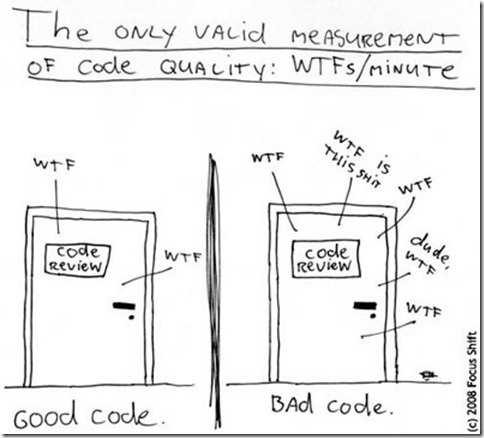

# <!-- fit -->Aspects of good quality code 
 
In the next part, you will review your code for

- Readability
- Reusability
- Robustness

#### Get your code ready!



---

# I. Code readability
#### Who is the audience that will read your code?

>Code is for computer, comments are for humans.

Who agrees with this statement?

---

# Code readability

- ~~Code is for computer, comments are for humans.~~

- Use whitespace and newlines strategically.

---

#### Compare:

```python
if foo == 'blah': do_blah_thing()
do_one(); do_two(); do_three()
```
**with**
```python
if foo == 'blah':
    do_blah_thing()

do_one()
do_two()
do_three()
```

Compound statements are generally discouraged, make generous use of newlines

---

# Code readability

- ~~Code is for computer, comments are for humans.~~

- Use whitespace and newlines strategically.

- use descriptive names for functions and variables
  - start functions with a verb
  - make variable names _just_ long enough to be meaningful

---

# Code readability
**Compare**

```r
for i in my_shopping_basket:
  if(test(i)) > 10:
    purch(i)
  else:
    disc(i)
```

---

# Code readability
**Compare**

```r
for i in my_shopping_basket:
  if(test(i)) > 10:
    purch(i)
  else:
    disc(i)
```
**with**
```r
for item in basket:
  if(testNecessity(item)) > 10:
    purchase(item)
  else:
    discard(item)
```

---

# Code readability

- ~~Code is for computer, comments are for humans.~~

- Use whitespace and newlines strategically.

- use descriptive names for functions and variables
  - start functions with a verb
  - make variable names _just_ long enough to be meaningful

- use a consistent style 
  - consistency will make your code easier to understand and maintain
  - consult a styleguide for your language (keep conventions, and don't reinvent the wheel)
  
---

# Variable naming
Compare:

```python
myVar = original_variable + MOD(new.var)
```
with

```python
my_var = original_var + Modified(new_var)
```
_consistency is key!_

---

# Comments
- Comments that contradict the code are worse than no comments. Always make a priority of keeping the comments up-to-date when the code changes! 
- Ensure that your comments are clear and easily understandable to other speakers of the language you are writing in (ENGLISH!)
- Delete commented code 
- Inline comments are unnecessary and in fact distracting if they state the obvious. 

Don’t do this
```python
x = x + 1                 # Increment x
```
This is more useful
```python
x = x + 1                 # Compensate for border
```

---

# Styleguides


- Python style manual: [PEP-8](https://www.python.org/dev/peps/pep-0008/)
- MATLAB style guide: [MATLAB File-exchange](http://cnl.sogang.ac.kr/cnlab/lectures/programming/matlab/Richard_Johnson-MatlabStyle2_book.pdf)
- Custom: [PVMD Toolbox](https://mrvogt.github.io/PVMD_docs/develop/style_guide.html)


_Are you already following a style guide? 
Would it make sense to adopt a style guide for the group?_

---

# Your turn

#### Where can you improve the readability of your code?

- Run a linter (e.g. `flake8` for Python, `checkcode` for MATLAB, or `lintr` for R) to identify conflicts with style guides.
  
- If you find code that is hard to read, make a note to work on it.
(Schedule time to refactor, but do not do this now!)

_Tip! Use_ `%TODO` _or_ `#TODO` _(depending on your comment marker) to easily find these spots later on. Many IDEs can extract these into a task list (including [MATLAB](https://nl.mathworks.com/help/matlab/matlab_prog/add-reminders-to-files.html))!_

---
#### Were you able to improve readability?
- Naming conventions
- Comments
- Formatting
- Compound statements