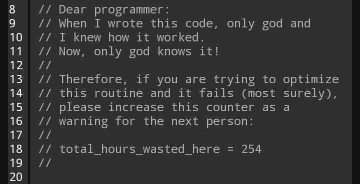

# Code reusability: some guidelines

- Separate code and data: data is specific, code need not be
  - consider using a config file for project-specific (meta)data in a interoperable datatype (`.json`, `yaml`)
  - but DO hard-code unchanging variables, e.g. `gravity = 9.80665`, **once**.

---
# Code reusability: some guidelines

- Do One Thing (and do it well)
  - One function for one purpose
  - One class for one purpose
  - One script for one purpose (no copy-pasting to recycle it!)

---
# Purity
- Pure functions have no notion of state, i.e. they take input values and return values
- Given the same input, a pure function _always_ returns the same value

### Stateful code
```python
f_to_c_offset = 32.0
f_to_c_factor = 0.555555555
temp_c = 0.0

def fahrenheit_to_celsius_bad(temp_f):
    global temp_c
    temp_c = (temp_f - f_to_c_offset) * f_to_c_factor

fahrenheit_to_celsius_bad(temp_f=100.0)
print(temp_c)
```
---
### Pure - no side effects
```python
def fahrenheit_to_celsius(temp_f):
    temp_c = (temp_f - 32.0) * (5.0/9.0)
    return temp_c
temp_c = fahrenheit_to_celsius(temp_f=100.0)
print(temp_c)
```
### Pure functions are easy to
- Test
- Understand
- Reuse
- Simplify
- Compose

---
# Divide and conquer
- Split up the code
- Construct your program from parts
    - functions
    - modules
    - packages (Python) or libraries (C or C++ or Fortran)

---
# Code reusability: some guidelines

- Don't Repeat Yourself (DRY): use functions
  - Write routines in functions, i.e., code you reuse often
  - Identify potential functions by action: functions perform tasks (e.g. sorting, plotting, saving a file, transform data...)
 

---
# Code reusability through functions

Functions are smaller code units reponsible of one task.

- Functions are meant to be reused

- Functions accept arguments (though they may also be empty!)

- What arguments a function accept is defined by its parameters

---
Functions do not necessarily make code shorter (at first)! Compare:

```python
indexATG = [n for n,i in enumerate(myList) if i == 'ATG']
indexAAG = [n for n,i in enumerate(myList) if i == 'AAG']
```
with

```python
def indexString(inputList: List, z: str) -> List:
  """Find index of string in list
  """
	zIndex = [n for n,i in enumerate(li) if i == z]
	return zIndex
	
indexATG = indexString(myList,'ATG')
indexAAG = indexString(myList,'AAG')
```

Now, you can reuse your function elsewhere, made it general, and have added additional documentation

---
# Your turn: visualize your code!

Choose:
- Make a screenshot, process it in paint, powerpoint, or your favorite editor;
- Copy paste your code to a text editor, and use markers.

The objective is for you to 'see' your code!

- Yellow denotes scripted, unstructured code _(basic, sequential lines of instructions)_
   
- Purple denotes functions or other structured code _(e.g. for-loops, conditionals, etc.)_

- Green denotes comments (or comment blocks)
   _(consider combining this with yellow for heavily commented code)_

Again, make notes in your code (`#TODO`!) if you see:
- **Scripted code**: this can be a function
- **Structured code**: this should be re-structured 

What can you learn from your colleagues today?

---

# Modular vs monolith

  

---

# Functions, functions, functions
- Build your code from functions
- Break your code down to more functions
    - if you have too many levels of indentation
    - if a function gets too long
    - if a function does more than one thing
    - if you find it hard to name a function
    - if you find it hard to write tests for a function
---

# <!-- fit --> Simplicity and clarity before elegance before efficiency

**Avoid premature optimization**
- Do not optimize
- If you have to optimize, do not optimize
- If you have to optimize, measure, do not guess

**Simple is better than complex**



---
# Your turn: make a function

You have visualized your code. Use your findings to improve it!

- **Preferably**: take scripted code and turn it into a function, _or_ split an existing function into two or more functions, _or_ generalize multiple similar functions (DRY!)

- If there is no function to work on: try and address the readability of your code.

_However_: for future exercises you will need at least one function, preferably with parameters, in your code! 