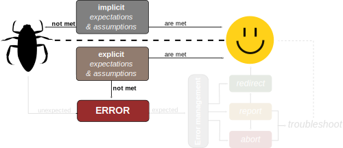
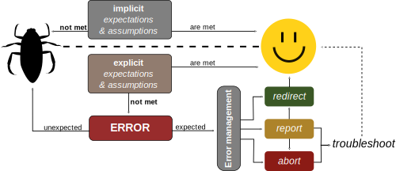

# III. Code robustness

In computer science, **robustness** is the ability of a computer system to cope with errors during execution and cope with erroneous input.

---


---



---



---

# Error management

#### Protect the user:

- Make assumptions and expectations explicit.
  - check values before processing them
  - identify and manage exceptions
- Produce errors when expectations are not met.
- Consider error options, and perform error management:
  - redirect the program
  - log or report the error, to allow the user (or developer) to troubleshoot
  - if necessary: abort the run
  
---

# Advanced robustness: testing

#### Protect the developer (including you!)

- Test the expected behavior of your functions:
  - Confirm a known output given a known input
  - Do errors get produced as expected when the input calls for it?
- Capture unexpected errors to identify further options for error management
- You can automate running tests when pushing to Github using Continuous Integration
- Tests are **definitely** worth learning when your project increases in size!

_Who is already applying tests in their project?_

---

# Throwing an error
```python
def read_vector_value(index=0, my_vector=[10,5,4,12,25]):
    if index > len(my_vector) - 1:
        raise IndexError('Index higher than vector length.')
    return my_vector[index]

read_vector_value(index=6)
```

---
#### Why not simply adjust the function output?
```python
def read_vector_value(index=0, my_vector=[10,5,4,12,25]):
    if index > len(my_vector) - 1:
        return None
    return my_vector[index]

print(read_vector_value(index=6))
```
- _Because it is unclear if `None` is expected behavior or indicative of a problem._
- _Because you now need to handle `None` downstream_


---

# Redirecting with exceptions

If you do not want to interrupt your script when an error is raised: use try/catch ('except' in Python). 

Note that Python and MATLAB allow you to distinguish by error type!

---
### Python

```python
def read_vector_value(index=0, my_vector=[10,5,4,12,25]):
    if index > len(my_vector) - 1:
        raise IndexError('Index higher than vector length')
    return my_vector[index]
```

This will catch the exception
```python
try: 
  read_vector_value(6)
except IndexError: ## raised
  print("This is an exception")
except ValueError: # not raised
  print("This is an exception")

```

---

### MATLAB
```matlab
function value = read_vector_value(index, my_vector)
    if index > length(my_vector)
        ME = MException('MyComponent:indexError', ...
            'Index higher than vector length');
        throw(ME)
    end
    value = my_vector(index);    
end
```

This will catch the exception
```matlab
try
  value = read_vector_value(6)
catch ME
  if (strcmp(ME.identifier, 'MyComponent:indexError'))
    disp("This is an exception")
  end
end
```

---

# Validating input


Consider early statements in the script to validate (data) input as a gatekeeper.

With if/else:
```python
if not protein_data:
  raise ValueError("Dataset cannot be empty")
```

_Tip: create a function to check inputs or use an argument parser_

---

# <!-- fit -->Expectations and assumptions

#### Expect the worst
- use of wrong input values for functions
- malformed text input
- wrong data types


---

# Your turn: explicit expectations

#### Identify assumptions in your code
- What assumptions/expectations exist on your data or (user) input?
- What assumptions/expectations exist on the input of (a) function(s)?
  
#### Make the input/data assumptions explicit
- Write a piece of code that tests the validity of data/input, and reports an error if the expectations are not met.

#### Test the input for a function
- Modify the code inside your function to check the value of the arguments using if/else statements and raise an error in case an argument is out of the range.

---

# Defensive programming

- Assume that mistakes will happen and introduce guards against them.
- Use assertions for things you believe will/should never happen.
- Use exceptions for anomalous or exceptional conditions requiring special processing.

```python
def kelvin_to_celsius(temp_k):
    """
    Converts temperature in Kelvin
    to Celsius.
    """
    assert temp_k >= 0.0, "ERROR: negative T_K"
    temp_c = temp_k - 273.15
    return temp_c
```
---

# Testing your code 

Untested software can be compared to uncalibrated detectors

>_Before relying on a new experimental device, an experimental scientist always establishes its accuracy. A new detector is calibrated when the scientist observes its responses to known input signals. The results of this calibration are compared against the expected response._

---

# Unit testing
Unit testing is a generic testing approach.

Your software is tested by focusing on smaller units, for instance a series of functions or class.

Extra packages\imports are needed

- in python with [pytest](https://docs.pytest.org/en/7.1.x/) or [unittest](https://docs.python.org/3/library/unittest.html)
- in Matlab with [Testing frameworks](https://nl.mathworks.com/help/matlab/matlab-unit-test-framework.html)


---

# When to write tests

**It is always a balance: there is no "always/never"**

### Questions to ask yourself
- Can I easily verify the outcome of my code visually (plot)?
- Do I want to reuse parts of my code?
- Do others rely on the code?
- Do I need to verify contributions form other developers
- How do I ensure bugs don't return?

---

# Example: Testing our read_vector function

With pytest
```python
# test_read_vector_value.py
def test_retrieval(self):
    self.assertEqual(read_vector_value(0), 10)

def test_error(self):
    with self.assertRaises(IndexError):
        read_vector_value(5)

```

In the terminal, call
```bash
pytest test_read_vector_value.py
```

---
# Example: Testing our read_vector function

In Matlab (with script-based testing)
```matlab
% test parameters
my_vector = [10,5,4,12,25];

%% Test 1: index
value = read_vector_value(3, my_vector);
assert(value == 4)

%% Test 2: index out of range
try
    value = read_vector_value(6, my_vector);
catch ME
    assert(strcmp(ME.identifier,'MyComponent:indexError'))
end
```

```matlab
results = runtests('test_read_vector_value')
```

---
# Your turn

#### Defensive programming
Check your code for conditions you believe will/should never happen and apply assert statements to prevent this.

#### Optional: Write a unit test
Write a unit test for a function

For python:
```bash
pip install pytest
```

---

# Summary: writing robust software
- Error management
- Try-except statements
- Defensive programming
- Unit tests
- Automate with GitHub Actions / Gitlab runners

#### Example: [PVMD Toolbox CI pipeline](https://gitlab.tudelft.nl/mrvogt/toolbox-m-code/-/pipelines/118914)


_Discuss the automated test framework in the PVMD toolbox with Malte or Alba_
