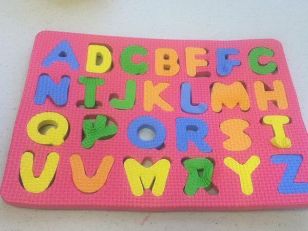

# Code robustness


---
# Code robustness


---
# Code robustness


---
# Error management

#### Protect the user:

- Make assumptions and expectations explicit.
  - check values before processing them
  - identify and manage exceptions
- Produce errors when expectations are not met.

- Consider error options, and perform error management:
  - redirect the program
  - log or report the error, to allow the user (or developer) to troubleshoot
  - if necessary: abort the run
  

---
# Advanced robustness: testing

#### Protect the developer (you!)

- Test the expected behavior of your functions:
  - Confirm a known output given a known input
  - Do errors get produced as expected when the input calls for it?
  
- Capture unexpected errors to identify further options for error management

- You can automate running tests when pushing to Github using Continuous Integration

- Tests are **definitely** worth learning when your project increases in size!

_More on tests later..._

---
# Throwing an error
```python
def read_vector_value(index=0, my_vector=[10,5,4,12,25]):
    if index > len(my_vector) - 1:
        raise IndexError('Index higher than vector length.')
    return my_vector[index]

read_vector_value(index=6)
```

---
#### Why not simply adjust the function output?
```python
def read_vector_value(index=0, my_vector=[10,5,4,12,25]):
    if index > len(my_vector) - 1:
        return None
    return my_vector[index]

print(read_vector_value(index=6))
```
- _Because it is unclear if `None` is expected behavior or indicative of a problem._
- _Because you now need to handle `None` downstream_

---
# Warning message without breaking
#### An error breaks code execution
```{R, error=TRUE}
read_vector_value <- function(index=1,my_vector=c(10,5,4,12,25)){
  if(index>length(my_vector)){
    stop("Index higher than vector length.")}
return(my_vector[index])
}

print(read_vector_value(index=6))
```
---
#### Capture the error but release a warning
```
read_vector_value <- function(index=1,my_vector=c(10,5,4,12,25)){
  if(index>length(my_vector)){
    warning("Index higher than vector length.")
    return(NA)}
return(my_vector[index])
}

print(read_vector_value(index=6))
```
---
# Redirecting with exceptions

If you do not want to interrupt your script when an error is raised: use try/catch ('except' in Python). NB: Note that Python allows you to distinguish by error type!
```{python, include=F}
# ensure that the function is correctly in memory
def read_vector_value(index=0, my_vector=[10,5,4,12,25]):
    if index > len(my_vector) - 1:
        raise IndexError('Index higher than vector length.')
    return my_vector[index]
```
.pull-left[
```{python, error=TRUE}
try:
  read_vector_value(6)
except IndexError:
  print("This is an exception")
```
]
.pull-right[
```{python, error=TRUE}
try:
  read_vector_value(6)
except ArithmeticError:
  print("This is an exception")
```
]

--

#### In R you can use [tryCatch()](http://www.mazamascience.com/WorkingWithData/?p=912):
```{R, include=FALSE}
read_vector_value <- function(index=1,my_vector=c(10,5,4,12,25)){
  if(index>length(my_vector)){
    stop("Index higher than vector length.")}
return(my_vector[index])
}
```
```{r}
tryCatch({
    read_vector_value(6)
}, error = function(e) {
    print("This is an exception.")
})
```

---
# Validating input

Consider early statements in the script to validate (data) input.

With if/else:
```python
if not protein_data:
  raise ValueError("Dataset cannot be empty")
```

With try/catch:
```r
tryCatch({
  do_something_that_might_go_wrong(protein_data)
}, error = function(e){
  log(e)
}, finally = {
  cleanup(protein_data)
})
```
---
# Expectations and assumptions

#### Expect the worst
- use of wrong input values for functions
- malformed text input
- wrong data types


---

# Your turn: explicit expectations

#### Identify assumptions in your code
- What assumptions/expectations exist on your data or (user) input?
- What assumptions/expectations exist on the input of (a) function(s)?
  
#### Make the input/data assumptions explicit
- **Option 1**: Explicitly state assumptions on data or input in your README.md.
- **Option 2**: Write a piece of code that tests the validity of data/input, and reports an error if the expectations are not met.

#### Test the input for a function
- Modify the code inside your function to
  - check the value of the arguments passed to your function using if/else statements;
  - raise an error in case an argument is out of the range of acceptable values.

---
# Testing your code 

Untested software can be compared to uncalibrated detectors

>_Before relying on a new experimental device, an experimental scientist always establishes its accuracy. A new detector is calibrated when the scientist observes its responses to known input signals. The results of this calibration are compared against the expected response._

---
# Unit testing
Unit testing is a generic testing approach.

Your software is tested by focusing on smaller units, for instance a series of functions or class.

Extra packages\\imports are needed

- in R with the testthat/testthis packages
  - https://github.com/r-lib/testthat, https://github.com/r-lib/testthis
- in python with pytest, unittest
  - https://docs.python.org/3/library/unittest.html 


---
# When to write tests

**It is always a balance: there is no "always/never"**

### Questions to ask yourself
- Can I easily verify the outcome of my code visually (plot)?
- Do I want to reuse parts of my code?
- Do others rely on the code?
- Do I need to verify contributions form other developers


---
# Running unit tests
__Code editors/IDEs__ such as visual studio code, RStudio, Pycharm...

- Integrate functionalities to run and show the results of unit tests
  - E.g., RStudio in the build menu -> test package
  
1. Create a unittest file
  
  ```R
  usethis::use_test("hello")
  ```
  
2. Edit the file test-hello.R in the tests folder (created by usethis)
  
  ```R
  test_that("multiplication works", {
    expect_equal(2 * 2, 4)
  })
  ```
  
3. Run tests
  - In RStudio using the menu __or__
  ```R
    devtools::test()
  ```
---
# Example

#### Testing our read_vector function

```{python}
import unittest
class TestStringMethods(unittest.TestCase):
    def test_retrieval(self):
        self.assertEqual(read_vector_value(0), 10)
    
    def test_error(self):
        with self.assertRaises(IndexError):
            read_vector_value(5)

```

Run the tests by calling `unittest.main()`

Or, when working in a notebook:
```{python}
unittest.main(argv=['trick to make it work in a notebook'], exit=False)
```

---
# Summary: writing robust software
- Error management
- Try-except statements
- Defensive programming
- Unit tests
- Automate with GitHub Actions

>_Program testing can be used to show the presence of bugs, but never to show their absence_

