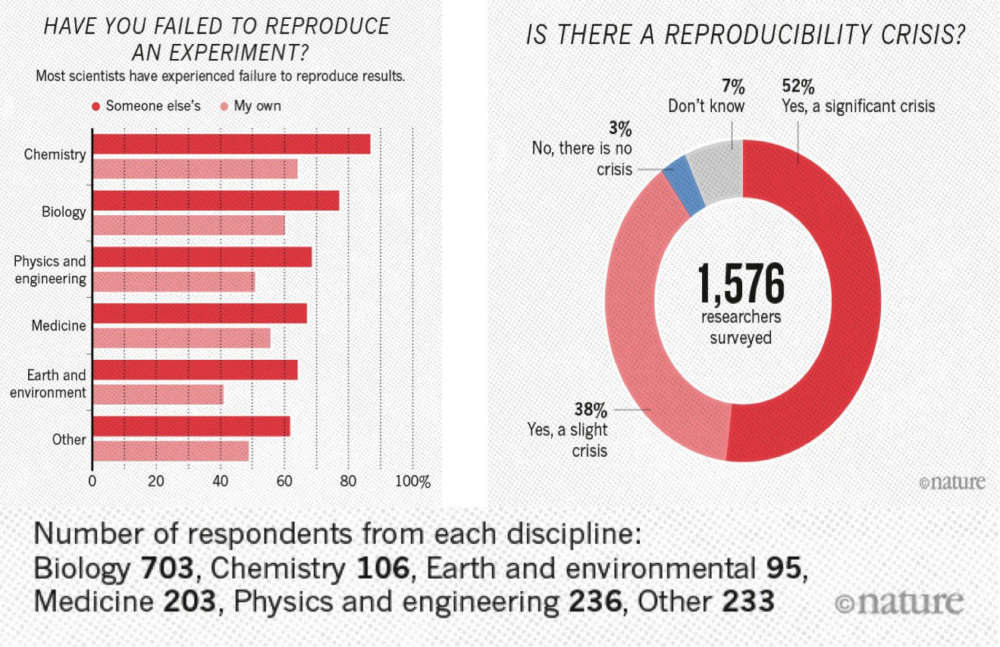
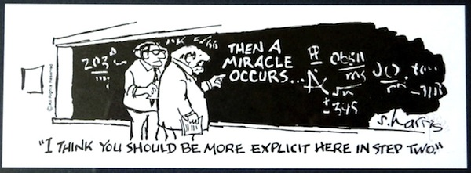

# Writing reproducible code

_Remember, your past self can also be the previous developer..._

---

# A scary anekdote

- A group of researchers obtain great results and submit their work to a high-profile journal.
- Reviewers ask for new figures and additional analysis.
- The researchers start working on revisions and generate modified figures, but find inconsistencies with old figures.
- The researchers can’t find some of the data they used to generate the original results, and can’t figure out which parameters they used when running their analyses.
- The manuscript is still languishing in the drawer …

---

# What is reproducible research?
>reproducibility refers to the ability of a researcher to **duplicate the results** of a prior study using the same materials as were used by the original investigator. That is, a second researcher might use the same raw data to build the same analysis files and implement the same statistical analysis in an attempt to yield the same results. Reproducibility is a **minimum necessary condition** for a finding to be believable and informative.
_U.S. National Science Foundation (NSF) subcommittee on replicability in science_

---

#  Why all the talk about reproducible research?
A 2016 [survey](https://www.nature.com/articles/533452a) in Nature revealed that irreproducible experiments are a problem across all domains of science:

---

# Would this be enough?
- Access to the code
- Access to the data
- (And let's assume we can replicate the environment)

#### How confident do you feel?

---

# Would this be enough?

#### We need to do more to inspire trust

- The code is correct (and I have made it easy for you/someone to check)
- My workflow is robust
- My workflow _itself_ is accessible, and I will be guiding you through it.
- Sufficient documentation on how the experiment is conducted and data is generated
- Clear steps on how to recreate the software environment (OS, dependencies, version)

---

---

# Advantages of reproducible code

1. Track a complete history of your research (version control is a **must**)
2. Facilitate collaboration and review process
3. Publish validated research and avoid misinformation
4. Write your papers, thesis and reports efficiently
5. Get credits for your work fairly
6. Ensure continuity of your work

---

---
## Be aware of the human side
- "Pleading the fith"
- No credit
- Lacking programming skills
- Sharing anxiety - Am I good enough? --> imposter syndrome

---

# Problems begin with "Lacking method decription"

Black box offered as scientific method:
- "Method is adapted from..." and additional steps only superficially described
- Method named, but details missing
- Complex models with no available code or even executable tools

---

# Method and data
>When results are produced by complex computational processes using large volumes of data, the methods section of a traditional scientific paper is insufficient to convey the necessary information for others to reproduce the results.

**Recommendations**
- Provide input, intermediate, and output data
- Provide detailed methods, ideally in executable format
- Provide information about the computational environment

---

# What is a computational environment
> Information about the computational environment where the study was originally executed, such as operating system, hardware architecture, and library dependencies.

#### Do you think this is sufficient?

---

## You should also consider...

- versions of dependencies (and their interoperability)
- configuration files and databases
- required (commercial) licenses, e.g. MATLAB
- tool for managing OS dependency (containers)
- for interactive systems, all user input provided by the user
- locales (language conventions)

---
# Your turn: list your dependencies

#### Inspect your project and list your dependencies

- operating system
- python dependencies
- MATLAB Add-ons

#### List the steps to recreate your results

---

---

# Steps towards reproducibility
1. Make sure you can find it (in space)
1. Make sure you can find it (in time)
1. Make sure you can recreate the environment where it lived at a specific time
1. Make sure you can execute the same sequence of operations
1. Make sure your environment and sequence of operations is robust and no human is needed to replicate what was done

---

# Steps towards replicable & robust code
1. Remove hardcoded bits and make the code modular
2. Test that the modules you made can take different types of input data or parameters
3. Turn the modules into a package/toolbox

---

# Steps towards generalisable code
1. License your code and get citations
2. Make sure your code is readable by humans
3. Make sure comments are present
4. Write useful documentation

___

# Version control with git
Version control allows you to **easily track changes**, both your own changes as well as those made by collaborators (for example, Git)

By configuring your version control system to use GitHub, GitLab or Bitbucket, you’ll have **backups** of every version. 

These platforms offer **collaboration tools** (issue tracker and project management tools), and you’ll be able to use third-party **services** such as code quality checkers, correctness checkers.

---

# Also useful if you do not code

- Working together on projects
- Setting up your website
- Making your work available to others (slides, newsletters)
- Keeping track of other projects (stars)
- Project management tools (Project Boards, Issues)

#### Examples
- Research: [Event Horizon Telescope](https://github.com/achael/eht-imaging)
- Tools: [Jupyter](https://github.com/jupyter/jupyter#readme) & [scikit-learn](https://github.com/scikit-learn/scikit-learn) (Written in Python)
- [Matpower](https://github.com/MATPOWER/matpower) (written in MATLAB)

---

# Some questions

#### Are you using version control
Topics we could discuss:
- [GitHub without the command line](https://coderefinery.github.io/github-without-command-line/)
- [Setting up git](https://utrechtuniversity.github.io/workshop-computational-reproducibility/docs/3-3-git.html)
- Discuss collaborative practices in PVMD toolbox

#### How do you handle collaborative issues?

#### How would you like to work if you could decide?

---

# The FAIR principles

Original paper demands that all scholarly digital research objects should be findable,
accessible, interoperable, and reusable

Increasingly recognized as essential for the transition towards Open Science

---

# FAIR for Research Software
- The Netherlands eScience Center - ["Five Recommendations for FAIR Software"](https://fair-software.nl)
- TU Delft DCC Guides - [Checklist](https://tu-delft-dcc.github.io/software/checklist.html) 

---

# Options for software sharing/publishing

_Slide by: Chue Hong, Neil (2021): Doing Science in the Digital Age (a personal journey as a data explorer). https://doi.org/10.6084/m9.figshare.17094365.v1 CC BY 4.0_