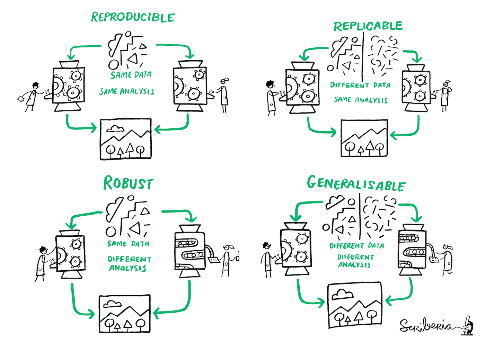
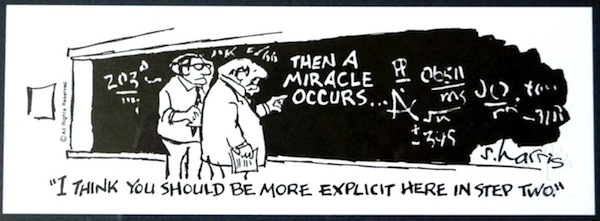
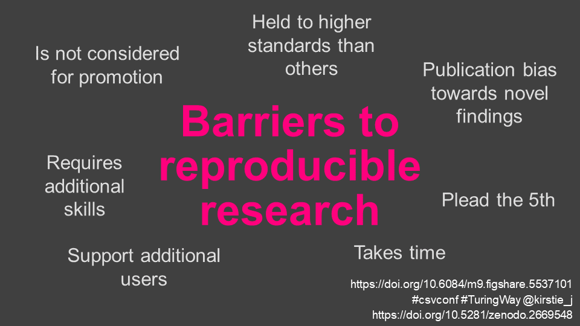
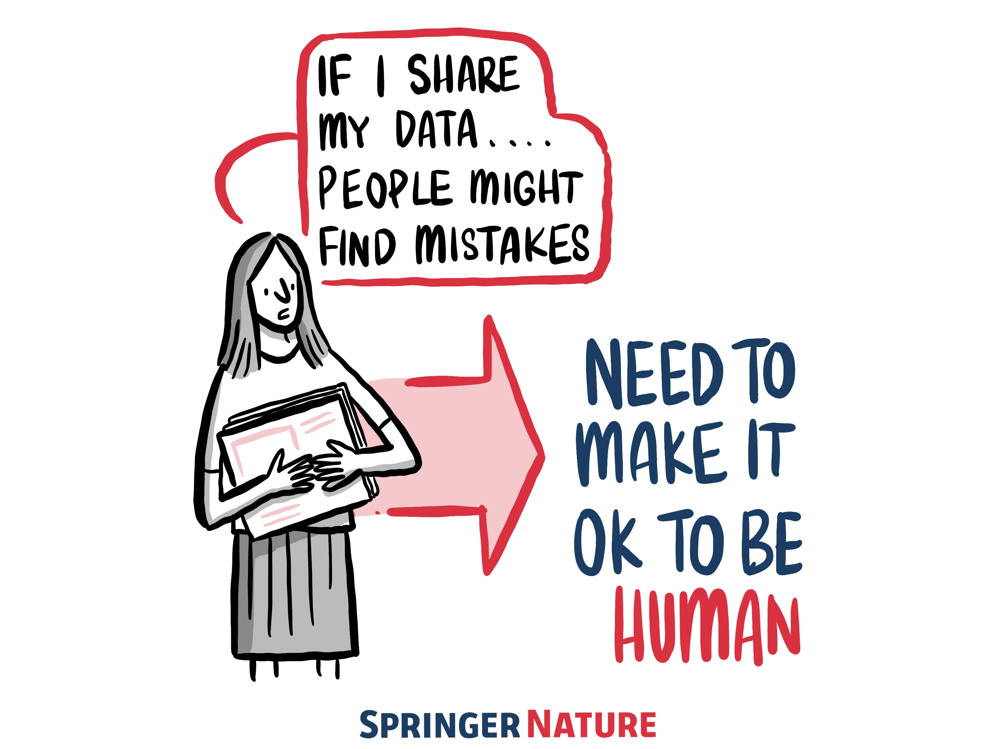
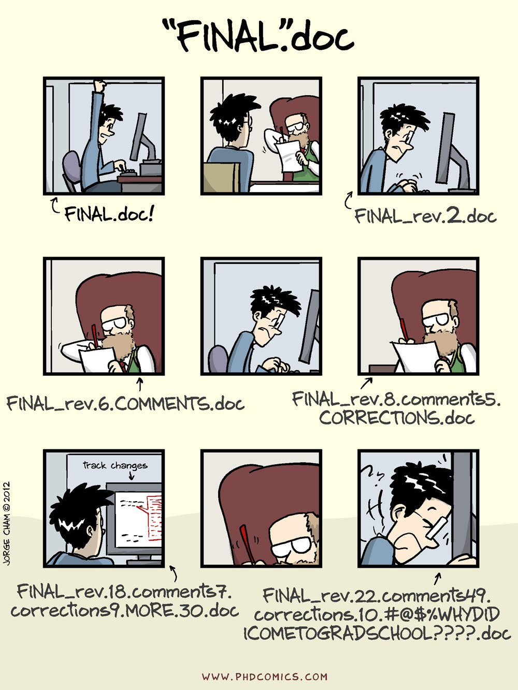
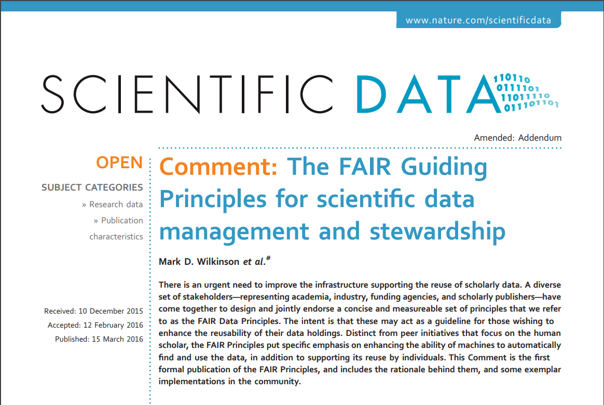

# Writing reproducible code


_Remember, your past self can also be the previous developer..._

---

# A scary anekdote

- A group of researchers obtain great results and submit their work to a high-profile journal.
- Reviewers ask for new figures and additional analysis.
- The researchers start working on revisions and generate modified figures, but find inconsistencies with old figures.
- The researchers can’t find some of the data they used to generate the original results, and can’t figure out which parameters they used when running their analyses.
- The manuscript is still languishing in the drawer …

---

# What is reproducible research?
>reproducibility refers to the ability of a researcher to **duplicate the results** of a prior study using the same materials as were used by the original investigator. That is, a second researcher might use the same raw data to build the same analysis files and implement the same statistical analysis in an attempt to yield the same results. Reproducibility is a **minimum necessary condition** for a finding to be believable and informative.
_U.S. National Science Foundation (NSF) subcommittee on replicability in science_

---



---

# Advantages of reproducible code

1. Track a complete history of your research (version control really is a _must_)
2. Facilitate collaboration and review process ([blog](https://quantumtinkerer.tudelft.nl/blog/demand-data-for-review/) Anton Akhmerov)
3. Publish validated research and avoid misinformation
4. Write your papers, thesis and reports efficiently
5. Get credits for your work fairly
6. Ensure continuity of your work

---

# Would this be enough?
- Access to the code
- Access to the data
- (And let's assume we can replicate the environment)

#### How confident do you feel?



---

# Would this be enough?

#### We need to do more to inspire trust

- The code is correct (and I have made it easy for you/someone to check)
- My workflow is robust
- My workflow _itself_ is accessible, and I will be guiding you through it.
- Sufficient documentation on how the experiment is conducted and data is generated
- Clear steps on how to recreate the software environment (OS, dependencies, version)

---

# Method and data
>When results are produced by complex computational processes using large volumes of data, the methods section of a traditional scientific paper is insufficient to convey the necessary information for others to reproduce the results.

**Recommendations**
- Provide input, intermediate, and output data
- Provide detailed methods, ideally in executable format
- Provide information about the computational environment


<!-- 
---


---
## Be aware of the human side
- "Pleading the fith"
- No credit for additional effort
- Lacking programming skills
- Sharing anxiety - Am I good enough? --> imposter syndrome


<!-- >Most importantly, we need to move away from a culture where publishing nothing is safer than publishing _something_. -->

<!--  --> -->

---

<!-- # Problems begin with "Lacking method decription"

Black box offered as scientific method:
- "Method is adapted from..." and additional steps only superficially described
- Method named, but details missing
- Complex models with no available code or even executable tools


--- -->


# What is a computational environment?
> Information about the computational environment where the study was originally executed, such as operating system, hardware architecture, and library dependencies.

#### Do you think this is sufficient? 
#### What other information would you need?

---

## You should also consider...

- versions of dependencies (and their interoperability)
- configuration files and databases
- required (commercial) licenses, e.g. MATLAB
- tool for managing OS dependency (containers)
- for interactive systems, all user input provided by the user
- locales (language conventions)


---

# Your turn: list your dependencies

#### Inspect your project and list your dependencies

- operating system
- python dependencies
- MATLAB Add-ons

#### Can you list the steps required to recreate your results?

---

# Organizing your code and data
- Contain your project in a single recognizable folder
- Distinguish folder _types_, name them accordingly:
    - **Read-only**: data, metadat
    - **Human-written**: code, paper, documentation
    - **Project-generated**: clean data, figures, models ...
- Initialize a **README** file, document your project
- Choose a **license**
- Publish your project

---

```
.
├── .gitignore
├── CITATION.md
├── LICENSE.md
├── README.md
├── requirements.txt
├── bin                <- Compiled and external code, ignored by git (PG)
│   └── external       <- Any external source code, ignored by git (RO)
├── config             <- Configuration files (HW)
├── data               <- All project data, ignored by git
│   ├── processed      <- The final, canonical data sets for modeling. (PG)
│   ├── raw            <- The original, immutable data dump. (RO)
│   └── temp           <- Intermediate data that has been transformed. (PG)
├── docs               <- Documentation notebook for users (HW)
│   ├── manuscript     <- Manuscript source, e.g., LaTeX, Markdown, etc. (HW)
│   └── reports        <- Other project reports and notebooks (e.g. Jupyter, .Rmd) (HW)
├── results
│   ├── figures        <- Figures for the manuscript or reports (PG)
│   └── output         <- Other output for the manuscript or reports (PG)
└── src                <- Source code for this project (HW)
```

---
# Tracking source code, data, and results
- All code is version controlled and goes in the `src/` directory
- Include appropriate LICENSE file and information on software requirements
- You can also version control data files or input files under `data/`
- If data files are too large (or sensitive) to track, untrack them using `.gitignore`
- Intermediate files from the analysis are kept in `data/processed`
- Consider using Git tags to mark specific versions of results (version submitted to a journal, dissertation version, poster version, etc.):

#### Example - CodeRefinery [word-count](https://github.com/coderefinery/word-count)

---

# A note on paths
- Your project shoudl be transportable between computers
- For this reason, you should use **relative paths**, compare
    - `C:/User/maurits/_projects/pvmd_toolbox/data/measurement.csv`
    - `./data/measurement.csv`
- It is fine to have the main script (e.g. `main.m`) in the home folder

To access code in subdirectories in MATLAB, you could make use of
```matlab
% main.m
here = mfilename('fullpath');
addpath(genpath(here));
```

---
# Choosing a license
- Copyright is implicit, others cannot use your code without your permission
- Licensing gives that permission, and its boudnaries and conditions
- Choosing a license early on means being aware of your license as the project proceeds (and not creating conflicts with dependencies) 

#### What is important to you? What does your group use? 
- [Choose a license](https://choosealicense.com/)
- The TU Delft offers pre-approved licenses: [TU Delft Research Software Policy](https://zenodo.org/record/4629662)

---
# Publishing your project
Uh... Isn't 'publication' the thing you do... _at the end_?

No! Publishing your project at an early stage
- forces you to consider readability throughout
- minimizes the mess you have to deal with when you (finally) decide to publish
- allows collaboration and support
- facilitates sharing and re-use.

_But what if someone scoops my code! I'm a revolutionary, they will steal my ideas!_

If you want to be more careful, you can always opt for a private repository. It is your work and up to you. But consider the advantages!

<!-- ---

# Options for software sharing/publishing


_Slide by: Chue Hong, Neil (2021): Doing Science in the Digital Age (a personal journey as a data explorer). https://doi.org/10.6084/m9.figshare.17094365.v1 CC BY 4.0_ -->

---
# Where do I publish?
#### Living project: GitHub / GitLab
- synergistic with version control software git
- makes history public and accessible (eek!)
- allows publication of different releases
- provides a platform for interaction and collaboration

#### Archival
- Zenodo or 4TU.ResearchData


---


---
# Why do you need version control?
- It will help you manage ~~your code~~ most of your files (it is like track changes on steroids: it applies to all files in a folder).
- It allows you to trace back your steps: if something breaks, you can figure out what happened.
- NO MORE thesis_final_final_SERIOUSLYFINAL.md

#### even better
- a good version control system allows you to collaborate and share!
- a good version control system facilitates experimentation!
- access to use third-party **services** such as code quality checkers, correctness checkers.

---

# Also useful if you do not code

- Working together on projects
- Setting up your website
- Making your work available to others (slides, newsletters)
- Keeping track of other projects (stars)
- Project management tools (Project Boards, Issues)

#### Examples
- Research: [Event Horizon Telescope](https://github.com/achael/eht-imaging)
- Tools: [Jupyter](https://github.com/jupyter/jupyter#readme) & [scikit-learn](https://github.com/scikit-learn/scikit-learn) (Written in Python)
- [Matpower](https://github.com/MATPOWER/matpower) (written in MATLAB)

---

# Some questions
- Are you using version control?
- How do you currently share your code?
- How do you collaborate on code (and handle issues)

#### Topics we could discuss:
- [GitHub without the command line](https://coderefinery.github.io/github-without-command-line/)
- [Setting up git](https://utrechtuniversity.github.io/workshop-computational-reproducibility/docs/3-3-git.html)
- Discuss collaborative practices in PVMD toolbox

<!-- ---

# Steps towards replicable & robust code
1. Remove hardcoded bits and make the code modular
2. Test that the modules you made can take different types of input data or parameters
3. Turn the modules into a package/toolbox

---

# Steps towards generalisable code
1. License your code and get citations
2. Make sure your code is readable by humans
3. Make sure comments are present
4. Write useful documentation -->

___

# Want to learn more?
- Software Carpentry [lessons](https://software-carpentry.org/lessons/)
- Code Refinery [lessons](https://coderefinery.org/lessons/)

#### Join a workshop (and receive GS credits)
- TU Delft [Training for Researchers](https://www.tudelft.nl/library/research-data-management/r/training-evenementen/training-voor-onderzoekers) (not available for students)
- Self-paced study (available to all!)

---

# The FAIR principles

Original paper demands that all scholarly digital research objects should be findable,
accessible, interoperable, and reusable

Increasingly recognized as essential for the transition towards Open Science



---

# FAIR for Research Software
#### Not a settled matter...

- The Netherlands eScience Center - ["Five Recommendations for FAIR Software"](https://fair-software.nl)
- TU Delft DCC Guides - [Checklist](https://tu-delft-dcc.github.io/software/checklist.html) 

---

# Steps towards reproducibility
1. Make sure you can find it (in space)
1. Make sure you can find it (in time)
1. Make sure you can recreate the environment where it lived at a specific time
1. Make sure you can execute the same sequence of operations
1. Make sure your environment and sequence of operations is robust and no human is needed to replicate what was done

---

